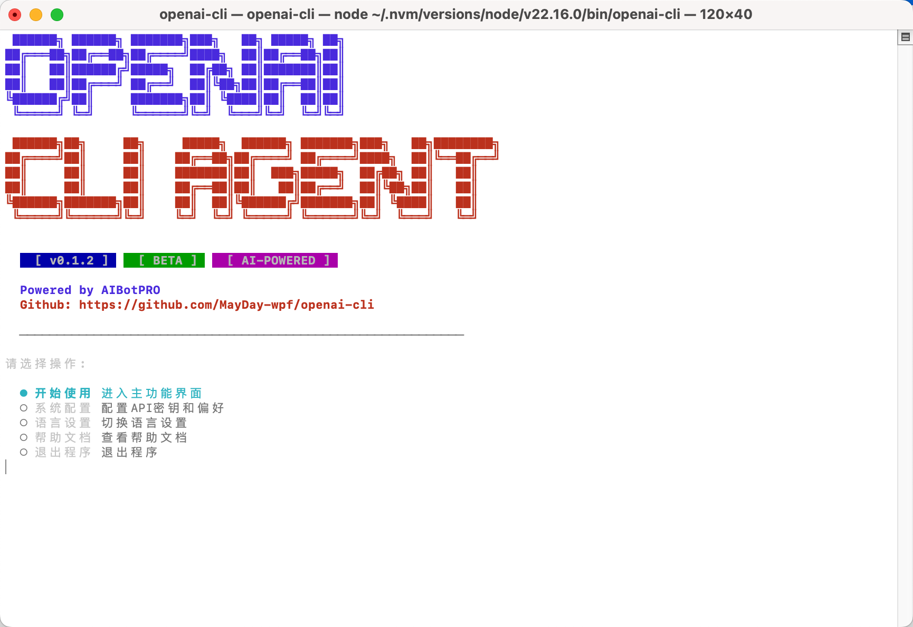
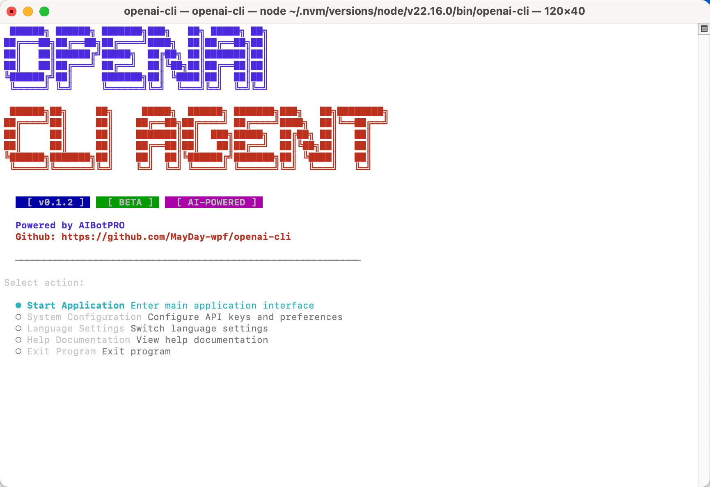

# OpenAI CLI Agent

<div align="center">
  <h3>🤖 下一代智能编程助手</h3>
  <p>基于 TypeScript 构建的强大 OpenAI CLI 编码代理</p>
  
  [](https://badge.fury.io/js/openai-cli-unofficial)
  [](https://opensource.org/licenses/MIT)
  [](https://nodejs.org/)
</div>

<div>
  
  
</div>

## ✨ 功能特性

- 🧠 **智能代码生成与优化** - AI 驱动的代码自动生成和优化建议
- 🔧 **自动化代码重构** - 智能重构和代码结构优化
- 📚 **智能文档生成** - 自动生成高质量的代码文档
- 🐛 **错误诊断与修复** - 智能错误检测和修复建议
- 📋 **编程最佳实践指导** - 遵循行业最佳实践的编程建议
- 🌍 **多语言支持** - 支持中文和英文界面

## 🚀 快速开始

### 安装

```bash
# 全局安装
npm install -g openai-cli-unofficial

# 或使用 yarn
yarn global add openai-cli-unofficial
```

### 使用

```bash
# 启动交互式界面
openai-cli

# 查看版本信息
openai-cli --version

# 显示帮助信息
openai-cli --help
```

## 💻 系统要求

- Node.js >= 16.0.0
- npm >= 7.0.0 或 yarn >= 1.22.0

## 🛠️ 开发

### 克隆项目

```bash
git clone https://github.com/MayDay-wpf/openai-cli.git
cd openai-cli
```

### 安装依赖

```bash
npm install
```

### 开发模式运行

```bash
npm run dev
```

### 构建项目

```bash
npm run build
```

## 📦 发布

### 构建并发布

```bash
# 清理并构建
npm run clean && npm run build

# 发布到 npm
npm publish
```

## 🤝 贡献

欢迎贡献代码！请先阅读贡献指南。

1. Fork 此项目
2. 创建你的功能分支 (`git checkout -b feature/AmazingFeature`)
3. 提交你的更改 (`git commit -m 'Add some AmazingFeature'`)
4. 推送到分支 (`git push origin feature/AmazingFeature`)
5. 打开一个 Pull Request

## 📄 许可证

此项目采用 MIT 许可证 - 查看 [LICENSE](LICENSE) 文件了解详情。

## 🐛 问题反馈

如果你发现了 bug 或有功能建议，请在 [Issues](https://github.com/MayDay-wpf/openai-cli/issues) 页面提交。

## 📞 联系方式

- 项目主页: [https://github.com/MayDay-wpf/openai-cli](https://github.com/MayDay-wpf/openai-cli)
- Bug 报告: [https://github.com/MayDay-wpf/openai-cli/issues](https://github.com/MayDay-wpf/openai-cli/issues)


## 🔆功能

- 文件系统操作
- TODOS
- 终端操作
- 第三方MCP兼容
- 自定义BaseURL、APIKEY
- OpenAI Completions 请求兼容
- 历史记录导出
- 检查点回滚
---

<div align="center">
  Made with ❤️ by the OpenAI CLI Team
</div>
